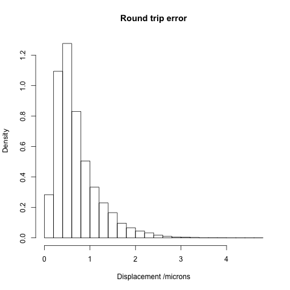

Introduction
============
The fly brain is a highly stereotyped 3D structure.  A number of groups have now published 3D confocal image datasets where all images have been registered to a specific template brain. For almost all purposes the fly brain should be considered symmetric about its mid-sagittal plane i.e. the plane perpendicular to the medio-lateral axis - typically the X axis in image data. However, while the platonic fly brain may be symmetric, individual fly brains that have been fixed, stained and imaged are often 
  - significantly asymmetric
  - not placed exactly in the centre of the image with respect to their mid-sagittal plane

While it is trivial to make template brains that are centred and possible to make symmetric template brains if one wishes, this has rarely been done in practice. It is therefore necessary to do more than simply mirror along the medio-lateral axis if one wishes to map neurons/structures in the left brain hemisphere onto the right hemisphere.

Details
=======
Each mirror registration in this repository maps one common template brain onto a medio-laterally flipped version of itself. It must therefore be combined with a preliminary step that flips the starting (image or point) data about the mid plane of the template image (typically YZ plane). The non-rigid registration therefore serves to fix the small displacements that are left after this simple flip. 

The naming convention for the preliminary rigid registration about the mid plane of the template image is `TARGET_xflip.list` where TARGET is a short name for the final template brain and `xflip` indicates the image axis along which the image was flipped. The subsequent non-rigid registration to fix any residual displacements due to asymmetries in the brain are called `TARGET_mirror.list`. Thus to map image data from the right to left (or vice versa) in the JFRC2 template space (see [virtual fly brain](http://www.virtualflybrain.org) for details) one would want to use `JFRC2_xflip.list` followed by `JFRC2_mirror.list`. 

Software
========
All registrations were constructed with the aid of the open source Computational Morphometry Toolkit ([CMTK](http://www.nitrc.org/projects/cmtk/)). In each case the final output contains a non-rigid (warping) intensity-based registration between two template brains (CMTK command `warp`). In certain cases the initial affine that was used as a starting step was computed using a surface or landmarks-based registration rather than CMTK's intensity based registration (`registration`).  You will need to install a recent (>=2.2) version of CMTK to use these registrations.

Usage
=====

First download (or git clone) this repository

We recommend that you convert all images to the [NRRD format](http://teem.sourceforge.net/nrrd/). [Fiji/ImageJ](http://fiji.sc) can read and write this format.

Image data
----------

    reformatx -o fully_mirrored_image.nrrd --floating simple_flipped_image.nrrd template_brain.nrrd target_mirror.list

Note that reformatx uses the `template_brain.nrrd` to determine the size and spatial location of the block of image data to produce. If you do not have the template brain, you can still produce output by manually defining the region that you want using reformatx's `--target-grid` option. 

    --target-grid <string>
              Define target grid for reformating as Nx,Ny,Nz:dX,dY,dZ[:Ox,Oy,Oz] (dims:pixel:offset)

For details

    reformatx --help

3D coordinates
--------------

White space separated 3d coordinates can be converted (in either direction) using 

    streamxform -- --inverse target_source.list < start_coords.txt > mirror_coords.txt
    streamxform target_source.list < target_coords.txt > sample_coords.txt

Note the use of the `--inverse` switch when mapping coordinates from source space to target space. This may be the opposite of what you expect but originates from the fact that in order to map a block of image data from source space to target space, the transformation that must actually be defined is the one that maps a regular grid of points in the target space back to sample locations in the source space. Note also the use of an extra `--` to separate the positional arguments from the other options when using `--inverse` to specify that a given registration should be inverted.

For details

    streamxform --help

Example
-------
Map a prominent point in the PLP from left to right

    cd /path/to/MirrorRegistrations
    echo 430 142.5 100 | streamxform --  --inverse JFRC2_xflip.list --inverse JFRC2_mirror.list
    # 206.67601 146.293051 105.666597

Now we can see how good our mirroring is 

    echo 206.67601 146.293051 105.666597 | streamxform --  --inverse JFRC2_xflip.list --inverse JFRC2_mirror.list
    # 429.836709 142.154807 99.4046885

i.e. close but not exactly the same point - due to the fact that the registration cannot perfectly match the two halves of the brain.

We can test the numerical stability of CMTK's inversion of the warping transformation by doing

    echo 206.67601 146.293051 105.666597 | streamxform -- JFRC2_mirror.list JFRC2_xflip.list
    # 430 142.5 99.9999995

i.e. errors due to numerical instabilities in the inversion are minimal in this case

Limitations
===========
These registrations should be very accurate because the non-rigid registration is operating on data from exactly the same specimen. This can be tested by calculating the round trip error 

    P->P'->P''

By way of example for the JFRC2 template we find a mean displacement of 0.7 microns. Of course the displacements are not uniform and structurally variable parts of the brain (e.g. antennal lobes) will likely show larger displacements.

In comparison across brain registration errors might be order 3-4 microns.